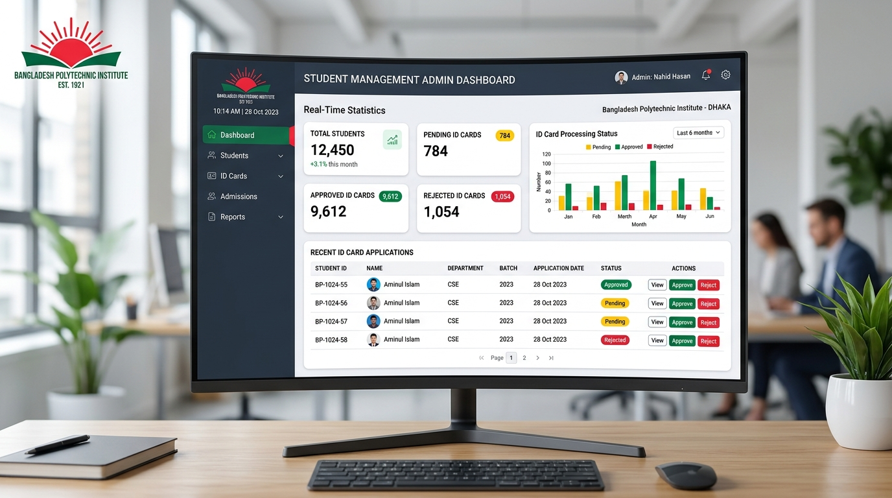
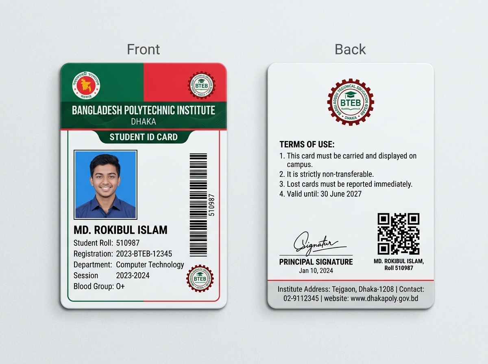
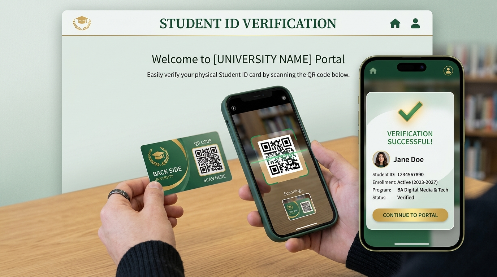
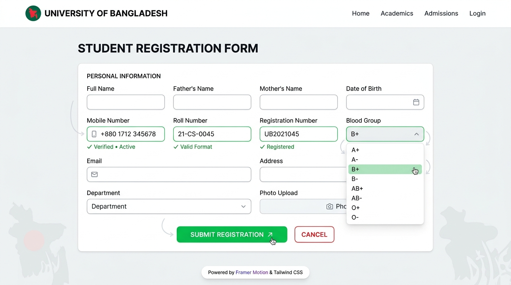

# 🇧🇩 পলিটেকনিক স্টুডেন্ট আইডি কার্ড জেনারেটর ও ভেরিফিকেশন সিস্টেম (poly-id-gen)

বাংলাদেশ পলিটেকনিক শিক্ষার্থীদের জন্য একটি ডিজিটাল আইডি কার্ড জেনারেটর এবং কিউআর কোড (QR Code) ভেরিফিকেশন সিস্টেম। ২০২৬ সালের আধুনিক যুগে এসেও কাগজের ম্যানুয়াল আইডি কার্ড প্রিন্ট করা অত্যন্ত সেকেলে, আর জাল বা ভুয়া কার্ড চিহ্নিত করা যেন এখন আর আতশকাচ দিয়ে দেখার মতো কঠিন না হয় - সেই উদ্দেশ্যেই এই সিস্টেমটি তৈরি করা হয়েছে।

---

## 🎯 এটি আসলে কী করে? (What this actually does)

তিনটি পোর্টাল, একটি উদ্দেশ্য: আইডি কার্ড তৈরির বিশৃঙ্খলা চিরতরে দূর করা।

* **পাবলিক সাইট (Public side):** রোল + রেজিস্ট্রেশন নম্বর দিয়ে অথবা কার্ডের পেছনে থাকা কিউআর কোড স্ক্যান করে সরাসরি ডাটাবেজ থেকে শিক্ষার্থীর বর্তমান এবং সঠিক তথ্য সেকেন্ডে যাচাই করুন। কোনো লগইন বা জটিলতা নেই। যদি কার্ডটি সিস্টেমে না থাকে, তবে সেটি 'Invalid' হিসেবে প্রদর্শিত হবে।
* **স্টুডেন্ট পোর্টাল (Student portal):** শিক্ষার্থীরা সহজে রেজিস্ট্রেশন ও লগইন করে নিজেদের ডিজিটাল আইডি কার্ড ঝকঝকে PNG (শেয়ার করার জন্য) এবং উচ্চ-মানের PDF (প্রিন্ট করার জন্য) আকারে ডাউনলোড করতে পারবে। (আমরা ক্যানভাস রেন্ডারারকে বিশেষভাবে মোবাইল অপ্টিমাইজড করেছি যাতে পুরনো মোবাইল ফোনেও এটি ক্র্যাশ না করে)।
* **অ্যাডমিন ড্যাশবোর্ড (Admin dashboard):** নতুন রেজিস্ট্রেশন অনুমোদন বা প্রত্যাখ্যান করা, ইনস্টিটিউটের লোগো ও স্বাক্ষর ডাইনামিকালি আপডেট করা, সেমিস্টার/শিফট/টেকনোলজি অনুযায়ী ফিল্টার ও সার্চ করা এবং – এটি তৈরি করতে বেশ বেগ পেতে হয়েছে – নির্বাচিত সকল শিক্ষার্থীর কার্ড একসাথে জিপ (ZIP) ফাইল আকারে বাল্ক এক্সপোর্ট করা। ফিচারটি চমৎকার কাজ করে!

---

## 📸 স্ক্রিনশটসমূহ (Screenshots)

### ১. অ্যাডমিন ড্যাশবোর্ড ওভারভিউ (Admin Dashboard Overview)


### ২. স্টুডেন্ট আইডি কার্ড প্রিভিউ (Student ID Card Preview)


### ৩. কিউআর কোড ভেরিফিকেশন ফ্লো (QR Verification Flow)


### ৪. রেজিস্ট্রেশন ফর্ম ভ্যালিডেশন (Registration Form Validations)


---

## 🛠️ জটিল বিষয়গুলো আমরা যেভাবে সমাধান করেছি (How we handle the messy parts)

**১. কঠোর ভ্যালিডেশন (Strict Validation):**
* ফোন নম্বর অবশ্যই `০১` (01) দিয়ে শুরু হয়ে ঠিক **১১ ডিজিট** হতে হবে। অভিভাবকের নম্বরের ক্ষেত্রেও একই নিয়ম প্রযোজ্য।
* রোল নম্বর অবশ্যই সঠিক ইংরেজি সংখ্যায় **৬ ডিজিট** এবং রেজিস্ট্রেশন নম্বর **১০ ডিজিট** হতে হবে।
* রক্তের গ্রুপ টাইপ করার বদলে ডেডিকেটেড **Blood Group Selector** ব্যবহার করা হয়েছে, যা স্পেসিং বা বানানের কোনো ভুল হতে দেয় না।

**২. কার্ড রেন্ডারিংয়ের জটিলতা দূরীকরণ (CORS-Safe ID Card Engine):**
* এক্সটার্নাল ইমেজের সোর্স লিংক ব্যবহারের কারণে ব্রাউজারে প্রায়শই CORS সমস্যা দেখা দেয়। এটি দূর করতে আমরা প্রতিটি ছবিকে ডাটাবেজে সরাসরি **Base64** ফর্ম্যাটে সুরক্ষিত রাখি। কোনো বাহ্যিক রিকোয়েস্ট নেই, তাই ডাউনলোডের সময় কোনো ছবি ব্ল্যাঙ্ক আসার সুযোগ নেই।
* কম মেমরির মোবাইল ফোনে ক্যানভাস যেন ক্র্যাশ না করে সেজন্য আমরা ডাইনামিক Pixel Ratio এবং নির্দিষ্ট রেন্ডারিং ডিলে (Delay) যুক্ত করেছি।

**৩. লাইভ কিউআর কোড ভেরিফিকেশন (Live QR Verification):**
* কার্ডের পেছনের কিউআর কোডটি কোনো স্ট্যাটিক ইমেজ নয়। এটি স্ক্যান করার সাথে সাথে আমাদের ভেরিফিকেশন এপিআই (API)-তে রিকোয়েস্ট চলে যায় এবং ডাটাবেজ থেকে রিয়েল-টাইম লাইভ ডেটা প্রদর্শন করে। কেউ কার্ডের ডিজাইন নকল করলেও ডাটাবেজে সঠিক তথ্য না থাকলে কিউআর কোড স্ক্যান করলে সেটি সফল দেখাবে না।

---

## 💻 টেক স্ট্যাক – কোনো বাহাদুরি নয়, যা কাজের ঠিক তাই (Tech Stack)

**ফ্রন্টএন্ড (Frontend):**
* **React 18 + Vite:** ক্রিয়েট-রিয়েক্ট-অ্যাপ (CRA) অত্যন্ত ধীরগতির, তাই আল্ট্রা-ফাস্ট লোডিংয়ের জন্য Vite ব্যবহার করা হয়েছে।
* **TypeScript:** আমরা প্রোডাকশনে যাওয়ার আগেই কোডের বাগ এবং টাইপ ডিফাইনগুলো ধরতে এটি পছন্দ করি।
* **Tailwind CSS:** সুন্দর, রেসপন্সিভ লেআউট এবং বাংলাদেশ সরকারের লাল-সবুজ আবহ বজায় রাখতে।
* **Framer Motion (`motion/react`):** দৃষ্টিনন্দন কিন্তু অতিরিক্ত নয় এমন ট্রানজিশন অ্যানিমেশনের জন্য।
* **html-to-image + jspdf:** ক্লায়েন্ট সাইড থেকে নিখুঁত ইমেজ ও পিডিএফ জেনারেশন।
* **lucide-react:** চমৎকার ও আকর্ষণীয় আধুনিক ভেক্টর আইকন লাইব্রেরি।

**ব্যাকএন্ড (Backend):**
* **Node.js + Express (TypeScript):** দ্রুত ও স্কেলেবল এপিআই (API) ডেভেলপমেন্ট।
* **Multer:** ইমেজ আপলোড করার সাথে সাথে সেটিকে Base64-এ কনভার্ট করার জন্য।
* **JWT (JSON Web Token):** শিক্ষার্থী ও অ্যাডমিনদের সুরক্ষিত সেশন ও অথেনটিকেশনের জন্য।

**ডাটাবেজ (Database):**
* **Supabase / PostgreSQL:** আমাদের সকল রিলেশনাল ডেটা ও জটিল রিলেশনগুলো অত্যন্ত দ্রুত হ্যান্ডেল করার জন্য।

---

## 🛡️ নিরাপত্তা বৈশিষ্ট্যসমূহ যা আমরা আসলেই গুরুত্ব দিয়েছি (Security features we care about)

* **রেট লিমিটিং (Rate Limiting):** প্রতি আইপি (IP) থেকে ১৫ মিনিটে সর্বোচ্চ ২০০টি রিকোয়েস্টের সীমাবদ্ধতা। এটি ব্রুট-ফোর্স বা DDoS আক্রমণ সম্পূর্ণরূপে রুখে দেয়।
* **লগ ক্লিনআপ (Log Cleanup):** ফ্রন্টএন্ডের প্রোডাকশন বিল্ড থেকে সকল প্রকার `console.log` মুছে ফেলা হয়েছে, যাতে সাধারণ ব্যবহারকারী বা হ্যাকাররা ইন্সপেক্ট এলিমেন্ট থেকে কোনো সংবেদনশীল তথ্য দেখতে না পারে।
* **টোকেন এক্সপায়ারি (Token Expiry):** জেনারেট হওয়া JWT সেশন টোকেনগুলো একটি নির্দিষ্ট সময় পর স্বয়ংক্রিয়ভাবে এক্সপায়ার হয়ে যায়, যা সেশন হাইজ্যাকিং প্রতিরোধ করে।
* **Base64 মিডিয়া স্টোরেজ:** আমাদের কোনো ইমেজ ডাউনলোড করার জন্য ওরিজিনাল প্রক্সি বা সিডিএন-এর ওপর নির্ভর করতে হয় না, যা CORS-জনিত ক্র্যাশ এড়িয়ে ডেটার সম্পূর্ণ সুরক্ষা নিশ্চিত করে।

---

## 🚀 নিজে রান করুন (Run it yourself)

প্রথমে প্রজেক্টটি ক্লোন করুন, তারপর নিচের ধাপগুলো অনুসরণ করুন:

১. আপনার টার্মিনালে প্রবেশ করে ডিপেন্ডেন্সি ইনস্টল করার জন্য নিচের কমান্ডটি চালান:
```bash
npm install
```

২. ডেভেলপমেন্ট মোডে রান করার জন্য লিখুন:
```bash
npm run dev
```

৩. প্রোডাকশন বিল্ড তৈরি করার জন্য নিচের কমান্ডটি ব্যবহার করুন:
```bash
npm run build
```

৪. সফলভাবে বিল্ড হওয়ার পর প্রোডাকশন রান করুন:
```bash
npm run start
```

---

*কারিগরি শিক্ষার্থীদের জন্য ডিজিটাল প্রযুক্তির ছোঁয়ায় তৈরি একটি অনন্য সৃষ্টি। প্রজেক্টটি আপনার ইনস্টিটিউটের ড্যাশবোর্ডে সচ্ছতা ও গতিশীলতা নিশ্চিত করবে।*
